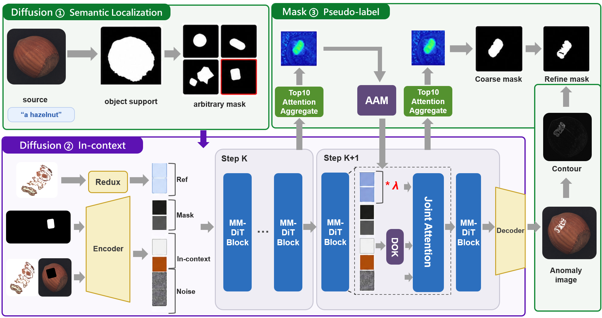
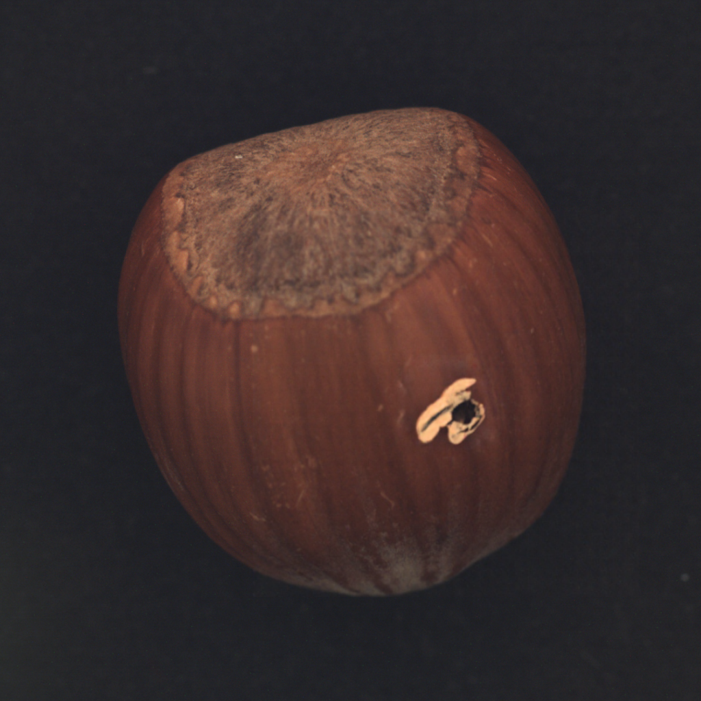

# REDiff-AD

Reference-guided diffusion anomaly editing with target-to-reference (T2R)
attention localization, adaptive reference injection, Shape-K diversity, and
refined anomaly masks.

> **Double-blind review:** author names and identifying source-repository
> metadata are intentionally withheld. They will be restored after review.

## Method overview

<p align="center">
  
</p>

## What is included

```text
run_in_context.py                       FLUX Fill, Redux and LoRA loading
batch_in_context.py                     image/mask preparation
generation_attention/                   T2R attention, diversity and refinement
configs/                                frozen T2R blocks and reproducibility data
demo_assets/mvtec_ad/hazelnut/          self-contained hazelnut demo subset
scripts/run_hazelnut_demo.sh            self-contained demo launcher
scripts/run_hazelnut_t2r.sh             main generation launcher
scripts/smoke_hazelnut_t2r.sh           one-image integration smoke test
scripts/validate_smoke_output.py         output/runtime validator
eval_diversity/                          KID, IS and IC-LPIPS
eval_downstream/                         classification and localization
```

The default method uses:

- Direct localization: T2R attention with the frozen Top-10 blocks.
- Adaptive reference injection: the same T2R Top-10 blocks.
- Shape-K diversity: 36 middle blocks, diffusion steps 12–20.
- Mask refinement: Q80 appearance refinement followed by contour refinement.
- FLUX transformer: bitsandbytes INT4/NF4 with the configured In-Context LoRA.

Implementation details are summarized in
[docs/ARCHITECTURE.md](docs/ARCHITECTURE.md), and the exact experimental
contract is in [docs/REPRODUCIBILITY.md](docs/REPRODUCIBILITY.md).

## 1. Installation

Python 3.11 and a CUDA-capable GPU are recommended. The verified generation
stack uses PyTorch 2.6.0 with CUDA 12.4.

```bash
git clone <ANONYMOUS_REPOSITORY_URL>
cd REDiff-AD

conda create -n rediff-ad python=3.11 -y
conda activate rediff-ad

pip install torch==2.6.0 torchvision==0.21.0 \
  --index-url https://download.pytorch.org/whl/cu124
pip install -r requirements.txt
```

For evaluation, install the optional dependencies in the same environment:

```bash
pip install -r requirements-eval.txt
```

The code uses these Hugging Face repositories:

- `black-forest-labs/FLUX.1-Fill-dev`
- `black-forest-labs/FLUX.1-Redux-dev`
- `WensongSong/Insert-Anything`

Request access where required, then authenticate:

```bash
huggingface-cli login
```

The full-dataset launchers default to local-cache-only mode. On the first run,
set `LOCAL_FILES_ONLY=0` to download the model files; later runs can omit it.
The self-contained demo below sets this automatically.

## 2. Self-contained hazelnut demo

The repository includes five normal hazelnut images and the `000` reference plus
mask for each defect (`crack`, `hole`, `print`, and `cut`). No dataset download
or `MVTEC_ROOT` is needed for this demo.

First validate every bundled asset and print the effective commands without
loading a model:

```bash
conda activate rediff-ad
DRY_RUN=1 LOG_TO_FILE=0 bash scripts/run_hazelnut_demo.sh
```

Generate five images for each of the four defects:

```bash
LOCAL_FILES_ONLY=0 bash scripts/run_hazelnut_demo.sh
```

Model access and Hugging Face downloads may still be required on the first
run. The default output is `outputs/hazelnut_in_context_demo_seed309`. Each
sample directory contains only the submission-facing artifacts:

- `edit.png`
- `coarse_mask.png`
- `contour_refined_mask.png`

Representative outputs from the verified hazelnut demo:

| Crack | Hole |
|:---:|:---:|
|  |  |
| **Print** | **Cut** |
|  |  |

The five bundled normal images are used as source-image candidates. Override
`SAMPLES_PER_ANOMALY` if a different number of outputs per defect is needed.
The demo defaults to `OVERWRITE=1`, so rerunning it refreshes its output folder;
set a different `RUN_NAME` or `OUT_ROOT` to preserve an earlier run.

The demo validates that all three final files exist before removing temporary
attention maps, overlays, metadata, and machine-specific runtime logs. Set
`DEMO_MINIMAL_OUTPUT=0` to retain the complete diagnostic output instead.

The bundled files, checksums, provenance, and asset-specific license are
documented in [demo_assets/mvtec_ad/README.md](demo_assets/mvtec_ad/README.md)
and [demo_assets/mvtec_ad/LICENSE.md](demo_assets/mvtec_ad/LICENSE.md).

## 3. Full dataset

Download MVTec AD from the
[official dataset page](https://www.mvtec.com/research-teaching/datasets/mvtec-ad)
and follow its license terms. Set `MVTEC_ROOT` to the directory containing the
object folders:

```text
<MVTEC_ROOT>/
  hazelnut/
    train/good/*.png
    test/crack/*.png
    test/hole/*.png
    test/print/*.png
    test/cut/*.png
    ground_truth/<defect>/*_mask.png
```

Either export the path or place the data under `datasets/` in this repository:

```bash
export MVTEC_ROOT=/path/to/mvtec_ad
```

Apart from the documented 13-image hazelnut demo subset, no dataset, model,
generated image, checkpoint, or log is tracked by Git.

## 4. Quick reproduction with the full dataset

First check all paths and effective parameters without loading a model:

```bash
conda activate rediff-ad
DRY_RUN=1 LOG_TO_FILE=0 bash scripts/smoke_hazelnut_t2r.sh
```

Run one hazelnut `crack` sample with reference `000`, seed 309, and 30 steps:

```bash
LOCAL_FILES_ONLY=0 bash scripts/smoke_hazelnut_t2r.sh
```

The default output is `outputs/smoke_rediff_ad_seed309`. Validate both its
files and recorded runtime configuration:

```bash
python scripts/validate_smoke_output.py \
  outputs/smoke_rediff_ad_seed309 \
  --defects crack --samples-per-defect 1
```

The validator checks active LoRA adapters, Direct/Adaptive T2R Top-10,
all-block attention, Shape-K calls, coarse/Q80/contour masks, and whether the
edit is localized inside the generated target mask.

## 5. Generation

Generate six samples for each hazelnut defect:

```bash
RUN_NAME=hazelnut_rediff_ad \
ANOMALIES_STR='crack hole print cut' \
SAMPLES_PER_ANOMALY=6 \
SEED=309 \
bash scripts/run_hazelnut_t2r.sh
```

Common overrides:

```bash
OBJECT_NAME=hazelnut                  # MVTec object folder
DATASET_ROOT=/path/to/mvtec/hazelnut # alternative to MVTEC_ROOT
REF_IDS_STR='000 000 000 000'         # one reference ID per defect
OUT_ROOT=outputs/my_run
OVERWRITE=0                           # resume matching complete samples
```

The main launcher also accepts another MVTec object through `OBJECT_NAME`,
`ANOMALIES_STR`, and `REF_IDS_STR`; no machine-specific absolute path is built
into the code.

Each sample directory contains:

- `edit.png`: generated image.
- `coarse_mask.png`: selected T2R Top-10 coarse mask.
- `all_block_coarse_mask.png`: all-block diagnostic mask.
- `q80_appearance_mask.png`: first refinement stage.
- `contour_refined_mask.png`: final mask used by downstream evaluation.
- `metadata.json` and `direct_aggregate_summary.json`: reproducibility records.

This complete layout applies to the full generation launcher. The demo uses
the three-file minimal layout documented above.

## 6. Evaluation

All evaluation launchers default to the `rediff-ad` conda environment and the
In-Context output layout. Set the generation and dataset roots once:

```bash
export RESULT_ROOT="$PWD/outputs/hazelnut_rediff_ad"
export MVTEC_ROOT=/path/to/mvtec_ad
```

Check the diversity-evaluation layout without computing metrics:

```bash
OBJ=hazelnut ANOMALIES='crack hole print cut' \
RESULT_ROOT="$RESULT_ROOT" REAL_ROOT="$MVTEC_ROOT" \
MAX_IMAGES=6 DRY_RUN=1 \
bash eval_diversity/run_in_context_eval.sh
```

Run KID, IS, and IC-LPIPS by removing `DRY_RUN=1`. Individual metrics can be
controlled with `RUN_KID`, `RUN_IS`, and `RUN_LPIPS`.

Prepare and verify localization pairs before training:

```bash
OBJ=hazelnut ANOMALIES='crack hole print cut' \
RESULT_ROOT="$RESULT_ROOT" MVTEC_PATH="$MVTEC_ROOT" \
MASK_NAME=contour_refined_mask.png MAX_IMAGES=6 PREPARE_ONLY=1 \
bash eval_downstream/run_in_context_localization.sh
```

Use the same command without `PREPARE_ONLY=1` for localization training.
Classification uses the corresponding launcher:

```bash
OBJ=hazelnut ANOMALIES='crack hole print cut' \
RESULT_ROOT="$RESULT_ROOT" MVTEC_PATH="$MVTEC_ROOT" \
MAX_IMAGES=6 PREPARE_ONLY=1 \
bash eval_downstream/run_in_context_classification.sh
```

See [docs/EVALUATION.md](docs/EVALUATION.md) for metric controls and mask
ablations. Very small smoke runs verify plumbing only and are not sufficient
for reporting paper metrics.

## Verification

CPU-only contract tests do not download models:

```bash
pip install -r requirements-dev.txt
make check
```

`configs/reproducibility.json` records the effective method settings and
SHA-256 hashes of runtime-critical source files. GitHub Actions checks these
contracts on every push.

Third-party model and dataset notices are listed in
[THIRD_PARTY_NOTICES.md](THIRD_PARTY_NOTICES.md). This anonymous review
snapshot does not grant a project-level redistribution license; attribution
and the archival license will be restored after review.
